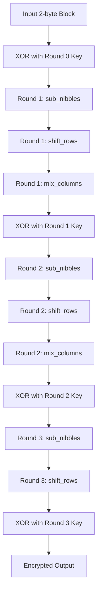
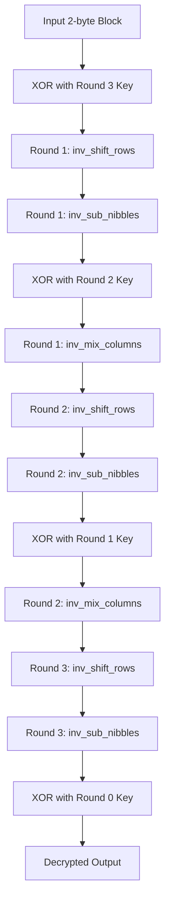
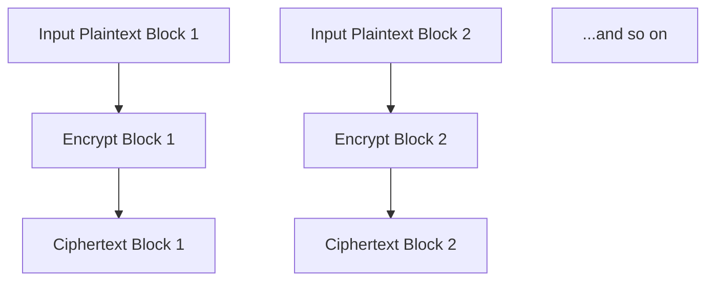
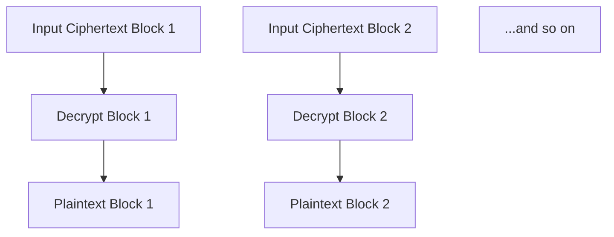
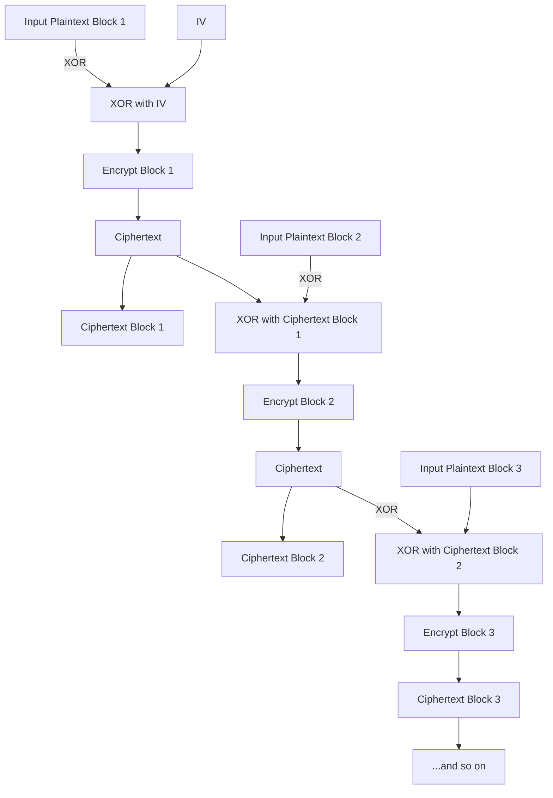
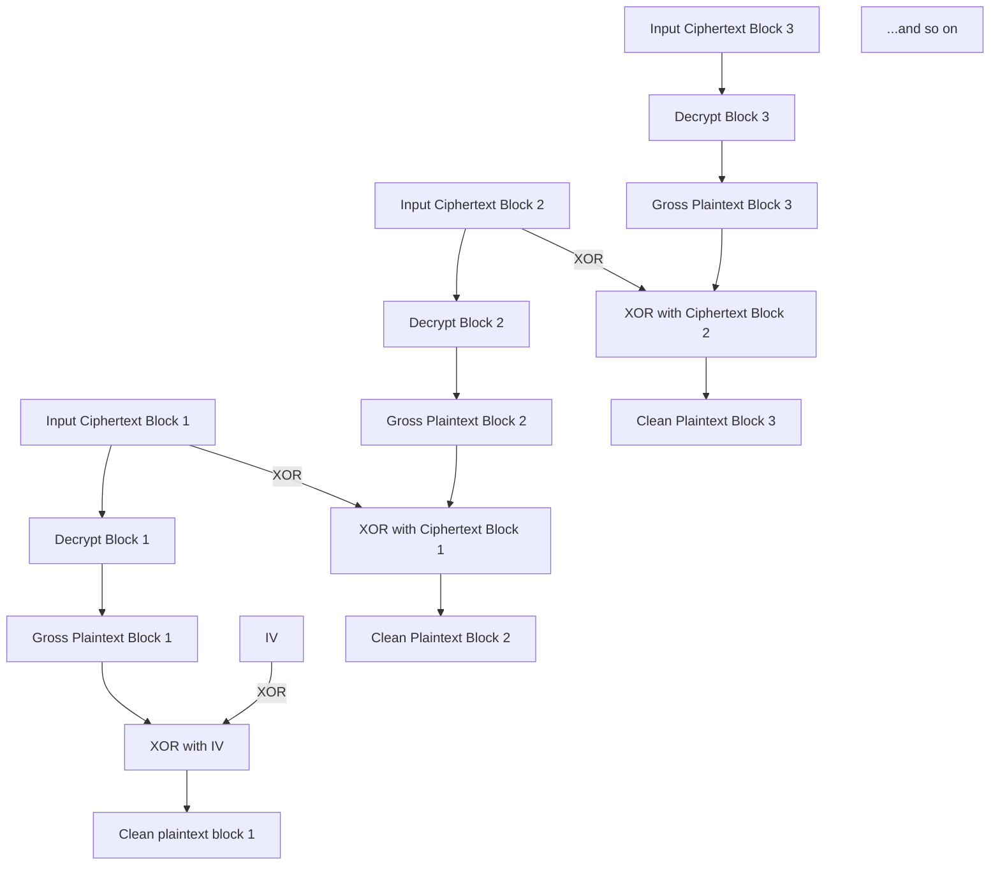

# Specifications of MiniAES

Run the code with streamlit:

```
streamlit run .\app.py

or

streamlit.bat run .\app.py
```

Each 2 bytes block is encrypted/decrypted with 3 rounds. Generally, it's similar to AES but reduced to work in 2 bytes mode. All addition, multiplication, and other similar operation is done in GF(2^4), with irreducible polynomial ([note](./irreducible_polynomial_note.md)):

```
m(x) = x^4 + x^3 + x^2 + x + 1
```

MDS in mixcolumn is ([note](./mds_note.md)):

```
-------
|02|03|
|01|02|
-------
```

The inverse mix column is using the inverse of the MDS, which is ([note](./mds_note.md)):

```
-------
|13|4 |
|9 |13|
-------
```

Sbox is in 4 bit, which is ([note](./s_box_note.md)):

```
[
    0xE, 0x4, 0xD, 0x1,
    0x2, 0xF, 0xB, 0x8,
    0x3, 0xA, 0x6, 0xC,
    0x5, 0x9, 0x0, 0x7,
]
```

And the inverse s-box is ([note](./s_box_note.md)):

```
[
    0xE, 0x3, 0x4, 0x8,
    0x1, 0xC, 0xA, 0xF,
    0x7, 0xD, 0x9, 0x6,
    0xB, 0x2, 0x0, 0x5
]
```

Each 2 bytes block is represented to 2x2 state array, following this note:

```
input bit is:
    ---------
    |in0|in2|
    |in1|in3|
    ---------

state array:
    -----------
    |s0,0|s0,1|
    |s1,0|s1,1|
    -----------

output bits:
    -----------
    |out0|out2|
    |out1|out3|
    -----------
```

Key is 2 bytes and key expansion is similar to AES, but done in 2 bytes. Rcon for each round is generated the same as AES, but for 3 rounds only. The state in key expansion follows this note:

```
data is in 2 bytes (16 bit).
each cell in the state array is a nibble (4 bit).

Using NIST FIPS 197 as reference, the input, state, and output
representation is as follows:

    input bit is:
        ---------
        |in0|in2|
        |in1|in3|
        ---------

    state array:
        -----------
        |s0,0|s0,1|
        |s1,0|s1,1|
        -----------

in there, key is word. here, it is byte:
    -------
    |b0|b1|
    -------
```

## Key Expansion

## Key Expansion Flow


Key is expanded with this rules:

```
If it's pre-round, key is the same as uploaded/given key.

Each round's key is generated following this formula:
    wi+5 = wi+4 ⊗ wi+1 (1)
    wi+6 = wi+5 ⊗ wi+2 (2)
    wi+7 = wi+6 ⊗ wi+3 (3)
while
    wi+4 = wi ⊗ g(wi+3) (4)
where g function is:
    - Perform a one-byte left circular
    rotation on the argument 4-byte word.
    - Perform a byte substitution for each
    byte of the word returned by the previous
    step by using the same 16x16 lookup table
    as used in the SubBytes step of the
    encryption rounds.
    - XOR the bytes obtained from the previous
    step with what is known as a round constant.
    The round constant is a word whose three
    rightmost bytes are always zero. Therefore,
    XOR'ing with the round constant amounts to
    XOR'ing with just its leftmost byte.

Way of generating round constant is got from:
(https://engineering.purdue.edu/kak/compsec/NewLectures/Lecture8.pdf)
in quote:
    The round constant for the ith round is denoted Rcon[i].
    Since, by specification, the three rightmost bytes of the round
    constant are zero, we can write it as shown below. The left hand
    side of the equation below stands for the round constant to be
    used in the ith round. The right hand side of the equation says
    that the rightmost three bytes of the round constant are zero.
        Rcon[i] = (RC[i], 0x00, 0x00, 0x00)
    The only non-zero byte in the round constants, RC[i], obeys
    the following recursion:
        RC[1] = 0x01
        RC[j] = 0x02 x RC[j - 1]

Remember that we are doing this in GF(2^4).

remember that instead of word, this key expansion works
with 2 byte.
```

## General Encryption Flow

## General Encryption Flow



Each 2 bytes block is encrypted with 3 rounds. Generally, it's similar to AES but reduced to work in 2 bytes mode.

Before round starts, data is XOR'ed with 0th round key (the given/uploaded key).

In 1st and 2nd round, it's:

1. `sub_nibbles`: Replace every nibble in state array using value from 4 bit S-Box.
1. `shift_rows`: Move the last row of the state array to the left. (`[[0,1],[2,3]] to [[0,3],[2,1]]`)
1. `mix_columns`: Matrix multiplication between MDS and state array, in GF(2^4) with given irreducible polynomial.
1. XOR with (n)th round key where n is the current round order.

In 3rd round, it's:

1. `sub_nibbles`: Replace every nibble in state array using value from 4 bit S-Box.
1. `shift_rows`: Move the last row of the state array to the left. (`[[0,1],[2,3]] to [[0,3],[2,1]]`)
1. XOR with 3rd round key where n is the current round order.

## General Decryption Flow



Each 2 bytes block is decrypted with 3 rounds. Generally, it's similar to AES but reduced to work in 2 bytes mode.

Before round starts, data is XOR'ed with the 3rd round key.

In 1st and 2nd round, it's:

1. `inv_shift_rows`: Move the last row of the state array to the right. (`[[0,1],[2,3]] to [[0,3],[2,1]]`)
1. `inv_sub_nibbles`: Replace every nibble in state array using value from 4 bit inverse S-Box.
1. XOR with 2nd round key if currently at 1st round, or 1st round key if currently at 2nd round.
1. `inv_mix_columns`: Matrix multiplication between inverse MDS and state array, in GF(2^4) with given irreducible polynomial.

In 3rd round, it's:

1. `inv_shift_rows`: Move the last row of the state array to the right. (`[[0,1],[2,3]] to [[0,3],[2,1]]`)
1. `inv_sub_nibbles`: Replace every nibble in state array using value from 4 bit inverse S-Box.
1. XOR with 0th round key (given/uploaded key).

## Mode of Operations

There are three main mode of operations:

1. Nonblock
1. ECB block
1. CBC block

Each mode of operation use exactly 2 bytes key only.

### Nonblock Mode

This mode of operation operate on exactly 2 bytes input and output. Subsequently, all uploaded or downloaded plaintext and ciphertext is in exactly 2 bytes. Encryption follows general encryption flow and decryption follows general decryption flow.

### ECB Block Mode

This mode of operation operate on size-free input and output, theoretically. Padding is using random pad, per 2 bytes. IV (Initialisation Vector) is prepended to each ciphertext, with random value from 0 to 0xFF. Each block is encrypted and decrypted independent of each other.

Flowchart for encryption is as follows:



And for decryption is as follows:



### CBC Block Mode

This mode of operation operate on size-free input and output, theoretically. Padding is using random pad, per 2 bytes. IV (Initialisation Vector) is prepended to each ciphertext, with random value from 0 to 0xFF.

For encryption, each block is XOR'ed with previous ciphertext block. If it's the first in line, it's XOR'ed with IV.

For decryption, each block decrypted and XOR'ed with previous ciphertext block. If it's the first in line, it's XOR'ed with IV.

Flowchart for encryption is as follows:



And for decryption is as follows:



## Test Case

This code is unit tested for Bit operations and Encryption/Decryption rounds. Run the unit test with:

```
python -m unittest
```

You might need to run this first though:

```
pip install -e .
```

### Nonblock Test Case

key:
```
aa
```

plaintext:
```
aa
```

ciphertext:
```
]å
```

### ECB block Test Case

key:
```
aa
```

plaintext:
```
aaaa
```

ciphertext (remember that padding is random, expect different value from last 2 bytes or so):
```
]å]åp‘
```

### CBC block Test Case

key:
```
aa
```

plaintext:
```
aaaa
```

ciphertext (remember that padding and iv is random, expect different value completely because this is CBC.):
```
ñ“®	'f‰Š
```

## Avalanche Effect

If unit test is ran, it will state average state change with key 0x000 and state from 0x0000 to 0xFFFF in bit count.

```
Average state change in nonblock decryption with key 0x000 and state from 0x0000 to 0xFFFF is 8.000122072175174
```

The recorded value from my test is 8.000122072175174, which if represented with percent, equals to 50.00076295109483% (average state change divided by 16, 16 from bit count in 0xFFFF). Based on strict avalanche criterion, this change is good enough (Avalanche effect, [wikipedia](https://en.wikipedia.org/wiki/Avalanche_effect)).


## Advantages

Because the program works in 2 bytes, expect faster processing and lower memory usage (compared to this program's algorithm, but in 16 bytes).

## Limitations

Key is only 2 bytes, very easy to attack. You can do brute force or exhaustive key attack easily, because key is only in range of 0x0-0xFFFF.

As a workaround, a very big random padding can be used to confuse attackers (Finite version of infinite monkey theorem, [wikipedia](https://en.wikipedia.org/wiki/Infinite_monkey_theorem)).
